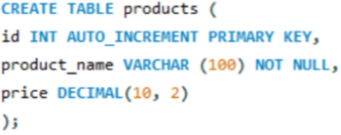
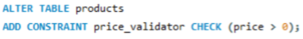
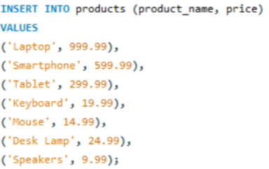
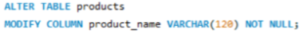
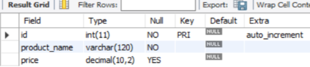
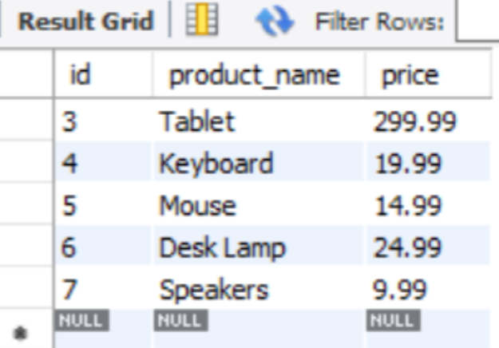
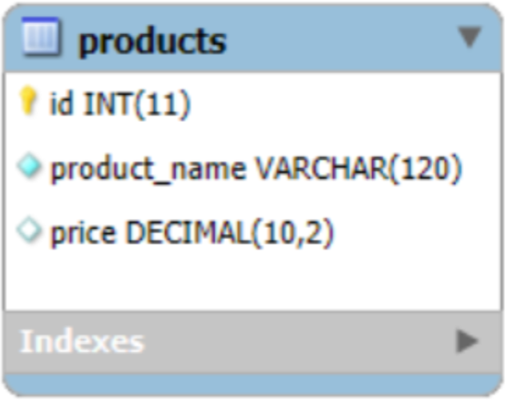

[←𝗚𝗼 𝗕𝗮𝗰𝗸](https://dtx-byte.github.io/Dxt_EDMPortfolio/)
# [Finals-Lab-Task-3](https://github.com/Dtx-byte/Final-Lab-Task-3/blob/main/Images/Dexter_FLT3.docx)
- This portfolio is about learning MySQL by creating and managing a product database. It includes simple tasks like making a table, adding rules, inserting correct data, and changing a field. The goal is to understand how to build and organize a database using basic SQL.

# Step by Step Process:
1. **Create the Table**  
   - Make a table named `products`.  
   - Add three fields:  
     - `id` (auto-increment and primary key)  
     - `product_name` (text up to 100 characters, cannot be empty)  
     - `price` (decimal number)

2. **Add a Rule**  
   - Add a `CHECK` constraint to make sure the `price` is more than 0.

3. **Insert Valid Products**  
   - Only add products with a positive price:
     - Laptop – 999.99  
     - Smartphone – 599.99  
     - Tablet – 299.99  
     - Keyboard – 19.99  
     - Mouse – 14.99  
     - Desk Lamp – 24.99  
     - Speakers – 9.99  
   - Skip items with negative prices.

4. **Update the Table**  
   - Change the `product_name` field to allow up to 120 characters.

# Screenshots
## Query Statements
### 1. Task 1
- 
### 2. Task 2
- 
### 3. Task 3
- 
### 4. Task 4
- 

# Table Structure
- 
- 

# ER Diagram
- 
